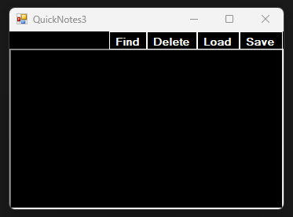
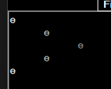
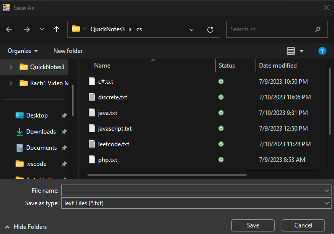
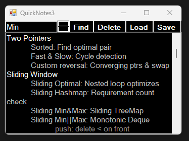

### Quicknotes 3
Bring out your best with this lightweight & intuitive notetaking application.  
Simplify academic workload and make your notes more readable with a simple, yet practical UI.  

### Install Quicknotes 3
In terminal, navigate to the directory in which you would like to install.  
Then, run the following commands:  

    git clone https://github.com/SewonKim0/QuickNotes3.git
    cd QuickNotes3/QuickNotes3/bin/Debug
    ./QuickNotes3

### Usage  
**Coloring & Indentation**  
Text coloring is done automatically based on tab indentation.  
This allows for an elegant, json-like structure for the displayed text, distinguishing the different layers of the document.  
  

**Save/Load/Delete**  
QuickNotes3 also supports a simple & convenient way to store and load notes, providing buttons for Save/Load/Delete operations.  
  

Notes will be stored in the user's local file system in the form of .txt files.
  

**Find**  
Finding keywords within the document is also easy, and can be done with the click of a button.  
Enter the keyword in the displayed input dialog and navigate with its adjacent up/down buttons.  
  

**Shortcuts**  
Here are the following keyboard shortcuts:  

    Ctrl+S: Save
    Ctrl+R: Reload
    Ctrl+F: Find
    Arrow Up: Traverse upwards during find operation
    Arrow Down: Traverse downwards during find operation
